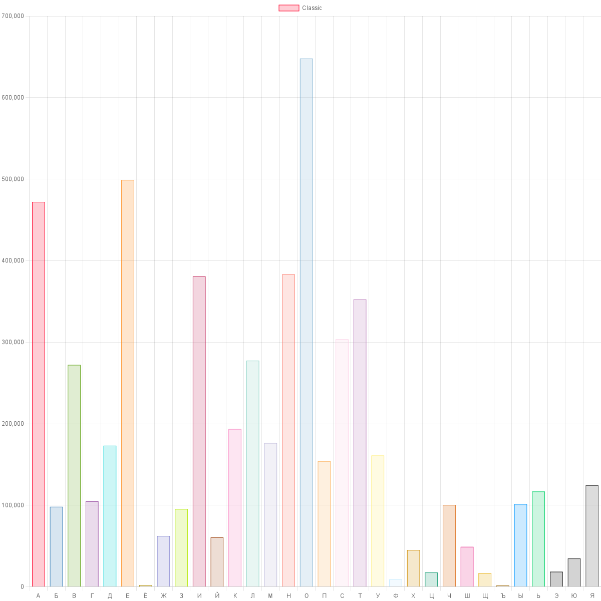
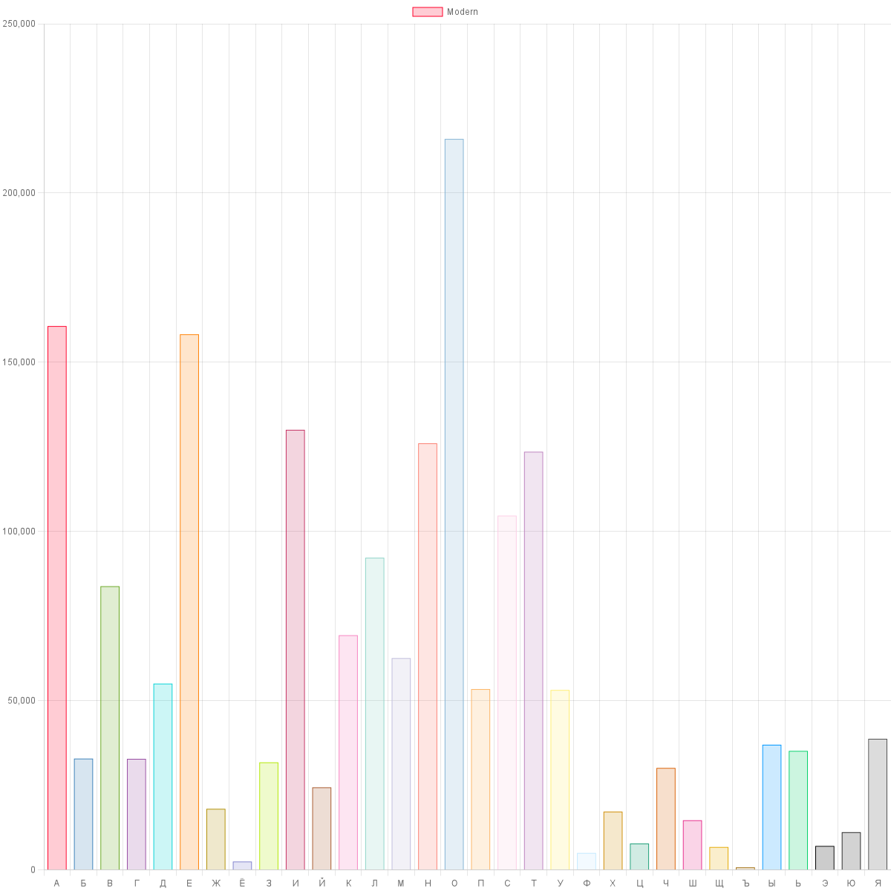

# Letter usage analyzer

This program counts number of letters usage in the provided texts and makes charts.

## Input

Local data is taken from the [Data directory](TextAnalyzer.Data/Data) and will be grouped by subfolders. *Don't forget to set **copy to output directory** property to **copy if newer***.

You can create your input provider by implementing [IInputTextStreamProvider](TextAnalyzer.Data/Interfaces/IInputTextStreamProvider.cs) interface.

Currently supported formats: Epub.
To add a new format please extend [FileText](TextAnalyzer.Data/Model/FileText.cs) and [FileTextFactory](TextAnalyzer.Data/Services/FileTextFactory.cs) with your file format.

## Charts

Charts are generated by [ChartjsNodeCanvas](https://github.com/SeanSobey/ChartjsNodeCanvas) invoked from .NET via [Javascript.NodeJS](https://github.com/JeringTech/Javascript.NodeJS).

### Chart sample

For classic russian literature

For modern russian literature

## Performance

Time spent on analysis of 20 large books is ~600ms.  
Time spent on this data rendering is ~2500ms due to the fact that rendering code is executed via nodejs.
