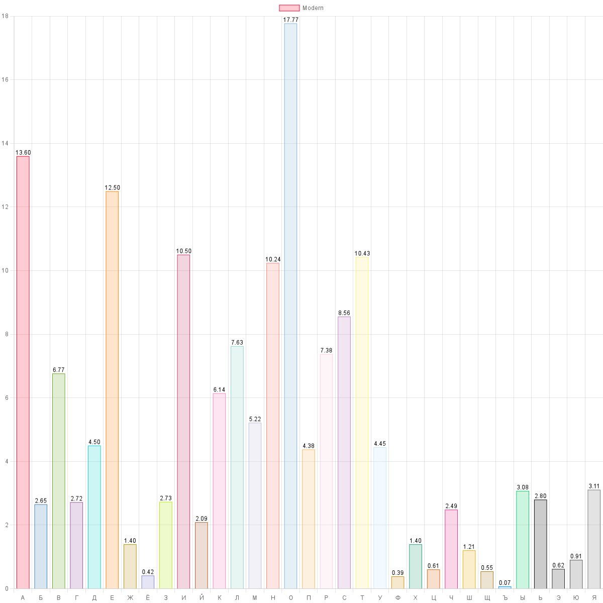

# Letter usage analyzer

This program counts number of letters usage in the provided texts and makes charts.

## Input

Local data is taken from the [Data directory](TextAnalyzer.Data/Data) and will be grouped by subfolders. *Don't forget to set **copy to output directory** property to **copy if newer***.

You can create your input provider by implementing [IInputTextStreamProvider](TextAnalyzer.Data/Interfaces/IInputTextStreamProvider.cs) interface.

Currently supported formats: Epub.
To add a new format please extend [FileText](TextAnalyzer.Data/Model/FileText.cs) and [FileTextFactory](TextAnalyzer.Data/Services/FileTextFactory.cs) with your file format.

## Charts

Charts are generated by [ChartjsNodeCanvas](https://github.com/SeanSobey/ChartjsNodeCanvas) invoked from .NET via [Javascript.NodeJS](https://github.com/JeringTech/Javascript.NodeJS).

## Chart sample

  
By letters count

  
  ### For classic russian literature
  

  ### For modern russian literature
  

  
By letters percentage

  
  ### For classic russian literature
  

  ### For modern russian literature
  

## Investigation results

- From the investigation, we can see that usage of the letter 'ё' has increased significantly. It's due to the fact that this letter was introduced in 1797 but its usage was [marginal](https://ru.wikipedia.org/wiki/%D0%81#%D0%94%D0%BE_1797_%D0%B3%D0%BE%D0%B4%D0%B0) thus it was avoided.
- The letter 'ф' is used more frequently in modern literature due to the increased number of foreign words.
- Modern literature is more concise than classic one. This we can see in letters count analysis results. All analyzed literature has the same form - novel.

## Performance

Time spent on analysis of 20 large books is ~560ms.  
Time spent on this data rendering is ~1500ms due to the fact that rendering code is executed via nodejs.
